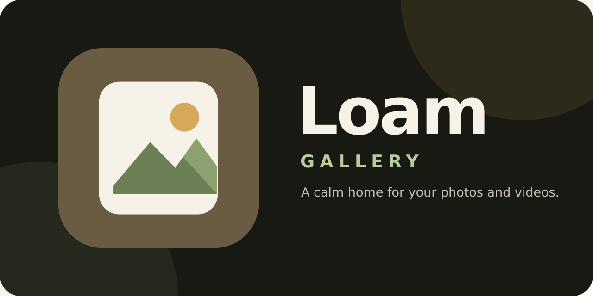



# Loam

A local photo and video gallery for Android, built with Kotlin and Jetpack Compose. Loam pairs a Samsung Gallery-inspired interface with customizable layouts, media playback, and everyday library management.

**Version:** 1.0.4 beta · **Android:** 8.0+ (API 26)

## Features

- Browse pictures, albums, and favorites with date sections, search, and adjustable grid layouts.
- View photos with zoom, non-destructive rotation, and a thumbnail filmstrip; play videos with Media3.
- Share media, inspect file details, and open images or videos from other apps.
- Personalize the interface with light, dark, or system appearance and five color palettes.
- Move media to the recycle bin, restore items, or permanently delete them with confirmation.
- Tune thumbnail quality, image caching, and preloading through experimental performance settings.

Loam is in beta. Editing tools, multi-select operations, cloud sync, and private albums are not included.

## Project structure

```text
Loam/
├── app/
│   ├── src/main/
│   │   ├── java/org/hndrx/loamgallery/
│   │   │   ├── data/                 # Media access, preferences, and recycle bin
│   │   │   ├── model/                # Media models, settings, and viewer geometry
│   │   │   ├── ui/                   # Compose screens, theme, and image loading
│   │   │   ├── GalleryViewModel.kt   # Gallery state and media operations
│   │   │   └── MainActivity.kt       # Entry point, permissions, and intents
│   │   ├── res/                      # Android resources
│   │   └── AndroidManifest.xml
│   ├── src/test/                     # JVM unit tests
│   └── build.gradle.kts              # App configuration and dependencies
├── gradle/wrapper/                   # Gradle wrapper configuration
├── Loam-Logo-Pack/                   # Branding assets and README banner
├── build.gradle.kts                 # Root build plugins
├── settings.gradle.kts              # Repositories and modules
├── gradle.properties                # Gradle settings
├── gradlew                          # macOS/Linux build entry point
├── gradlew.bat                      # Windows build entry point
├── TESTING.md                       # Device validation checklist
└── LICENSE
```

## Installation

1. Clone the repository:

   ```sh
   git clone https://github.com/hndrx67/Loam.git
   cd Loam
   ```

2. Install JDK 17 and Android SDK Platform 36. Use Android Studio with support for Android Gradle Plugin 8.13.2, and select JDK 17 as the Gradle JDK.
3. Open the project in Android Studio and let Gradle sync. Ensure `local.properties` points to your Android SDK using `sdk.dir` (Android Studio normally creates this file).
4. Connect an Android 8.0+ device with USB debugging enabled, or start an emulator. Select the `app` configuration and click **Run**.

Grant photo and video access when prompted to populate the gallery.

## Building

Run commands from the repository root. The included wrapper downloads Gradle 8.13; no separate Gradle installation is needed.

**Windows (PowerShell)**

```powershell
.\gradlew.bat :app:assembleDebug
```

**macOS / Linux**

```sh
chmod +x gradlew
./gradlew :app:assembleDebug
```

The debug APK is generated at `app/build/outputs/apk/debug/app-debug.apk`. To build and install directly on a connected device or running emulator, use `:app:installDebug` in place of `:app:assembleDebug`.

For a release build, run `:app:assembleRelease`. Release signing is not configured in this repository; configure a signing key before distributing a release APK.

## Verification

Run JVM tests and Android lint:

```powershell
# Windows
.\gradlew.bat :app:testDebugUnitTest :app:lintDebug
```

```sh
# macOS / Linux
./gradlew :app:testDebugUnitTest :app:lintDebug
```

Reports are written to `app/build/reports/`. See [TESTING.md](TESTING.md) for device validation covering playback, permissions, appearance, and recycle-bin behavior.

## Media storage

On Android 11+, Loam uses the system recycle bin and its expiry policy. On Android 8–10, it stores recovery copies in private app storage; clearing app data or uninstalling Loam removes those copies. Permanent deletion cannot be undone. Favorites are stored locally in Loam.

## License

Licensed under the [GNU General Public License v2](LICENSE).
